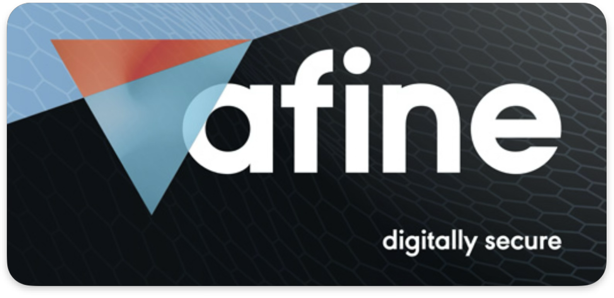

# Snake & Apple
  
This is the code repository for the "[Snake & Apple](https://karol-mazurek.medium.com/list/snakeapple-50baea541374)" article series, which documents my research on macOS security. The primary tool developed during the creation of the series is called `CrimsonUroboros`. You can find its description, along with instructions for other tools in this repository, in [Tools.md](https://github.com/Karmaz95/Snake_Apple/blob/main/TOOLS.md).

## ARTICLES
I have been writing about Apple Security across different platforms for years, compiling them in this repository. Currently, I am writing on [Patreon](https://www.patreon.com/Karol_Mazurek). All articles are free, except those marked with a `*`, which are [exclusive content](https://www.patreon.com/collection/1529482) for Elite Patrons—my "thank-you" to the folks who support me.

---
Each main article directory contains three subdirectories:
* `mac` - source code of macOS for references and copy of presentations.
* `custom` - code, for example, programs written for articles.
* `python` - contains the latest CrimsonUroboros and other Python scripts created during research. 
---
The short introduction is written in [Snake&Apple Intro](https://karol-mazurek.medium.com/snake-apple-ff87a399ecc4?sk=v2%2Fb2295773-88e6-4654-9d3d-61d73b9001e5)  
The tags for each article are in the [Article_tags.md](Article_tags.md).  
The table of contents showing links to all articles is below:
* ☑ [App Bundle Extension](https://karol-mazurek.medium.com/snake-apple-app-bundle-ext-f5c43a3c84c4?sk=v2%2F3ff105ad-f4f0-464d-b4d5-46b86c66fe14)
  * ☑ [Cracking macOS apps](https://karol-mazurek.medium.com/cracking-macos-apps-39575dd672e0?sk=v2%2F727dce55-53ee-45f6-b051-2979e62f2ba1)
  * ☑ [Cracking Electron Integrity](https://karol-mazurek.medium.com/cracking-electron-integrity-0a10e0d5f239?sk=v2%2F7726b99c-c6c9-4d70-8c37-da9f2f0874e8)
  * ☑ [XPC Programming on macOS](https://karol-mazurek.medium.com/xpc-programming-on-macos-7e1918573f6d?sk=v2%2F21c4e9c7-40a5-43dd-804b-0d8f9bc4e94c)
  * ☑ [AppleScript for Vulnerability Research](https://www.patreon.com/posts/applescript-for-130305213) `*`
  * ☑ [LLDB for Vulnerability Research](https://www.patreon.com/posts/lldb-for-131084875) `*`
  * ☑ [Scaling Vulnerability Discovery on macOS](https://www.patreon.com/posts/scaling-on-macos-131937045) `*`
  * ☑ [Applications Patch Diffing on macOS](https://www.patreon.com/posts/applications-on-131618568) `*`
  * ☑ [Threats of Unvalidated XPC Clients on macOS](https://afine.com/threats-of-unvalidated-xpc-clients-on-macos/)
* ☑ [I. Mach-O](https://karol-mazurek.medium.com/snake-apple-i-mach-o-a8eda4b87263?sk=v2%2Ffc1cbfa4-e2d4-4387-9a82-b27191978b5b)
  * ☑ [Optimizing Mach-O Detection](https://karol-mazurek.medium.com/optimizing-mach-o-detection-40352101bbef?sk=v2%2F3378d3f5-874b-4b82-94d5-b2ccd8522ea3)
  * ☑ [Static Analysis on Decompiled Code](https://www.patreon.com/posts/static-analysis-135790081) `*`
* ☑ [II. Code Signing](https://karol-mazurek.medium.com/snake-apple-ii-code-signing-f0a9967b7f02?sk=v2%2Fbbc87007-89ca-4135-91d6-668b5d2fe9ae)
  * ☑ [To allow or not to get-task-allow, that is the question](https://afine.com/to-allow-or-not-to-get-task-allow-that-is-the-question/)
* ☑ [III. Checksec](https://karol-mazurek.medium.com/snake-apple-iii-checksec-ed64a4b766c1?sk=v2%2Fb4b8d637-e906-4b6b-8088-ca1f893cd787)
* ☑ [IV. Dylibs](https://karol-mazurek.medium.com/snake-apple-iv-dylibs-2c955439b94e?sk=v2%2Fdef72b7a-121a-47a1-af89-7bf53aed1ea2)
  * ☑ [Breaking Hardened Runtime: The 0-Day Microsoft Delivered to macOS](https://afine.com/breaking-hardened-runtime-the-0-day-microsoft-delivered-to-macos/)
  * ☑ [Dyld Shared Cache Patch Diffing based on CVE-2025-43400](https://www.patreon.com/posts/dyld-shared-on-140770478) `*`
* ☑ [V. Dyld](https://karol-mazurek.medium.com/snake-apple-v-dyld-8b36b674cc44?sk=v2%2F4acb16f8-fa88-41f0-8d7c-1362f4060010)
  * ☑ [DYLD — Do You Like Death? (I)](https://karol-mazurek.medium.com/dyld-do-you-like-death-i-8199faad040e?sk=v2%2F359b081f-d944-409b-9e7c-95f7c171b969)
  * ☑ [DYLD — Do You Like Death? (II)](https://karol-mazurek.medium.com/dyld-do-you-like-death-ii-b74360b8af47?sk=v2%2Ff0cff71c-5345-4228-a639-653325fc979d)
  * ☑ [DYLD — Do You Like Death? (III)](https://karol-mazurek.medium.com/dyld-do-you-like-death-iii-af77701a3034?sk=v2%2F06c92503-2db9-40e2-b139-c9ae0a35e7b3)
  * ☑ [DYLD — Do You Like Death? (IV)](https://karol-mazurek.medium.com/dyld-do-you-like-death-iv-ede6b157752c?sk=v2%2F87ebe38d-004c-41a6-bc1f-43898494a512)
  * ☑ [DYLD — Do You Like Death? (V)](https://karol-mazurek.medium.com/dyld-do-you-like-death-v-c40a267573cb?sk=v2%2F4c9f16b2-59bd-406a-945d-10a1fba1001b) 
  * ☑ [DYLD — Do You Like Death? (VI)](https://karol-mazurek.medium.com/dyld-do-you-like-death-vi-1013a69118ff?sk=v2%2F37b3a61f-8483-4b38-977d-7f860944862b)
  * ☑ [DYLD — Do You Like Death? (VII)](https://karol-mazurek.medium.com/dyld-do-you-like-death-vii-62c202f98610?sk=v2%2Fab26bfcf-ba56-493d-9af3-2d8790ca6208)
  * ☑ [DYLD — Do You Like Death? (VIII)](https://karol-mazurek.medium.com/dyld-do-you-like-death-viii-327d7e7f3c0f?sk=v2%2F6c6b611d-fee4-4d9d-8a36-d59a05116e23)
  * ☑ [DYLD — Do You Like Death? (IX)](https://karol-mazurek.medium.com/dyld-do-you-like-death-ix-5052c865100e?sk=v2%2Fe078d739-ab30-4f2d-8a12-eefc63dd73b4)
  * ☑ [DYLD — Do You Like Death? (X)](https://karol-mazurek.medium.com/dyld-do-you-like-death-x-76408570c357?sk=v2%2F8b69c2f1-ce13-4d05-bba1-e0164c3de381)
  * ☑ [DYLD — Do You Like Death? (XI)](https://karol-mazurek.medium.com/dyld-do-you-like-death-xi-cef76bc8dc14?sk=v2%2F0b88b392-ae94-43d0-9120-109306051e00)
* ☑ [VI. AMFI](https://karol-mazurek.medium.com/snake-apple-vi-amfi-31c48fb92d33?sk=v2%2F8116bf86-e0a7-42be-ada9-5348447c01fd)
  * ☑ [Unexpected but expected behavior](https://karol-mazurek.medium.com/unexpected-but-expected-behavior-bf281cc21ee2?sk=v2%2Fda20f402-b7fa-4bb1-a160-83e758cdd513)
* ☑ [VII. Antivirus](https://karol-mazurek.medium.com/snake-apple-vii-antivirus-0a57acc10185?sk=v2%2F2c46d7ac-4435-41e6-bbda-2acb4eb78c76)
  * ☑ [Apple Gatekeeper Bypass](https://karol-mazurek.medium.com/apple-gatekeeper-bypass-4315bbb33018?sk=v2%2F3c20fa28-1a3d-4bd0-9a25-79646f60c44f)
* ☑ [VIII. Sandbox](https://karol-mazurek.medium.com/snake-apple-viii-app-sandbox-5aff081f07d5?sk=v2%2F5b65151b-d1f3-4f18-93da-4ad9aeacadb7)
  * ☑ [SBPL Compilator](https://karol-mazurek.medium.com/sbpl-compilator-c05f5304d057?sk=v2%2F4ae3bf90-ff12-4fea-b0fc-0f2ef60d7b93)
  * ☑ [Sandbox Detector](https://karol-mazurek.medium.com/sandbox-detector-4268ab3cd361?sk=v2%2F58fe49fb-1381-4db3-9db9-3f6309e4053a)
  * ☑ [Sandbox Validator](https://karol-mazurek.medium.com/sandbox-validator-e760e5d88617?sk=v2%2F145ac2ef-ca06-41a0-b310-c96f4ce0037b)
  * ☑ [App Sandbox startup](https://karol-mazurek.medium.com/app-sandbox-startup-71daf8f259d1?sk=v2%2F9f3b09a6-c7c0-445d-8613-8e25bf3f4e4d)
  * ☑ [System Integrity Protection](https://karol-mazurek.medium.com/system-integrity-protection-sip-140562b07fea?sk=v2%2F9c293b8f-c376-4603-b8a1-2872ba3395cf)
* ☑ [IX. TCC](https://karol-mazurek.medium.com/snake-apple-ix-tcc-ae822e3e2718?sk=v2%2F426ae6cf-6418-4e3f-a0ca-3aee06d6f676)
  * ☑ [Apple UUID Finder](https://karol-mazurek.medium.com/apple-uuid-finder-a5173bdd1a8a?sk=v2%2F04bb0d32-6dc9-437d-bf72-8f65e03fed90)
  * ☑ [Threat of TCC Bypasses on macOS](https://afine.com/threat-of-tcc-bypasses-on-macos/)
  * ☑ [TCC Bypass in Visual Studio Code via misconfigured Node fuses](https://afine.com/tcc-bypass-in-microsoft-visual-studio-code-via-misconfigured-node-fuses/)
  * ☑ [Reverse Engineering Apple’s TCC Daemon: When Decompiled Code Lies](https://afine.com/reverse-engineering-apples-tcc-daemon-when-decompiled-code-lies/)
* ☑ [X. NU](https://karol-mazurek.medium.com/snake-apple-x-nu-0bc5c36170da?sk=v2%2F502ee9db-8d8a-4a1b-8655-546742a7d261)
  * ☑ [Kernel Debugging Setup on MacOS](https://karol-mazurek.medium.com/kernel-debugging-setup-on-macos-07dd8c86cdb6?sk=v2%2F782bf539-a057-4f14-bbe7-f8e1ace26701)
  * ☑ [Fixing an Infinite Loop](https://karol-mazurek.medium.com/fixing-an-infinite-loop-on-unix-e0a8a5501c54?sk=v2%2F140555f8-9770-4c6b-9734-d9c5b7cc9bc7)
  * ☑ [Exceptions on macOS](https://karol-mazurek.medium.com/exceptions-on-macos-2c4bd6a9fd31?sk=v2%2Ffa7393a6-16e7-46d4-84d0-4de300260533)
  * ☑ [MACF on macOS](https://karol-mazurek.medium.com/macf-on-macos-004b8a490e2c?sk=v2%2Fd9a61281-e230-4ac6-8608-ad062f4d2a9a)
  * ☑ [Kernel Extensions on macOS](https://karol-mazurek.medium.com/kernel-extensions-on-macos-1b0f38b632ea?sk=v2%2Fb6920735-90f9-459c-9c10-30980247bae7)
  * ☑ [Mach IPC Security on macOS](https://karol-mazurek.medium.com/mach-ipc-security-on-macos-63ee350cb59b?sk=v2%2F3afce264-9b59-447f-84ea-b1988606191a)
    * ☑ [Task Injection on macOS](https://afine.com/task-injection-on-macos/)
  * ☑ [Drivers on macOS](https://karol-mazurek.medium.com/drivers-on-macos-26edbde370ab?sk=v2%2F8a5bbc18-aae7-4a68-b0dd-bb5ce70b5752)
    * ☑ [Case Study: Analyzing macOS IONVMeFamily NS_01 Driver Denial of Service Issue](https://afine.com/case-study-analyzing-macos-ionvmefamily-driver-denial-of-service-issue/)
    * ☑ [Case Study: IOMobileFramebuffer NULL Pointer Dereference](https://afine.com/case-study-iomobileframebuffer-null-pointer-dereference/)
    * ☑ [A mouse move that crashed the system – Stack Buffer Overflow in Display Driver on macOS](https://afine.com/a-mouse-move-that-crashed-the-system-stack-buffer-overflow-in-display-driver-on-macos/)
    * ☑ [Mapping IOKit Methods Exposed to User Space on macOS](https://phrack.org/issues/72/9_md#article) #PHRACK 💀
  * ☑ [SLAP & FLOP: Apple Silicon’s Data Speculation Vulnerabilities](https://afine.com/slap-flop-apple-silicons-data-speculation-vulnerabilities/)
  * ☑ [History of NULL Pointer Dereferences on macOS](https://afine.com/history-of-null-pointer-dereferences-on-macos/)

* ☐ [Apple Intelligence]()
  * ☑ [AI-Enhanced Vulnerability Research](https://www.patreon.com/posts/ai-enhanced-135545364) `*`

## REFERENCES
I have studied tons of resources, crediting other researchers and their contributions at the end of each article I wrote. Thank you all for sharing your hard-earned knowledge for free. You are all awesome! However, two individuals have significantly accelerated my progress, and I want to honor them:

* **[Jonathan Levin](https://x.com/Morpheus______)** – His [*OS Internals trilogy](https://newosxbook.com/home.html) helped me rapidly learn the beauty of the macOS system. If there is a single resource I would recommend for anybody, it is the masterpiece you wrote. Thank you, Jonathan.

* **[Patrick Wardle](https://x.com/patrickwardle)** – He created the [OBTS conference](https://objective-see.org/), where many brilliant minds come together to share their research. You've created something to look forward to every year. Thank you, Patrick.

## PATRONS

## Repository popularity
